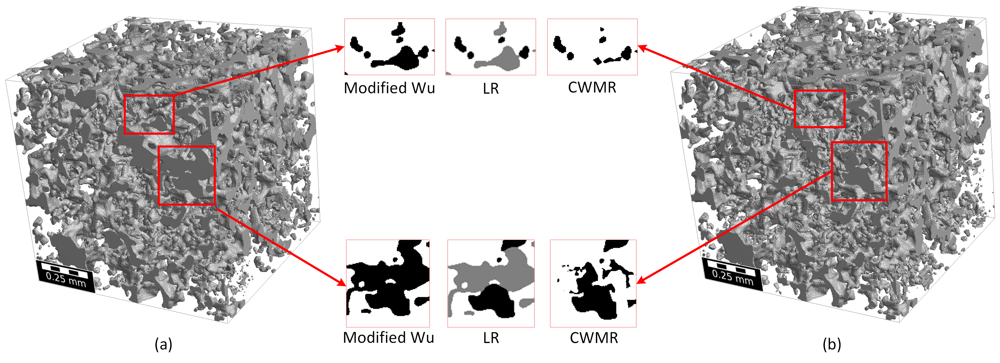
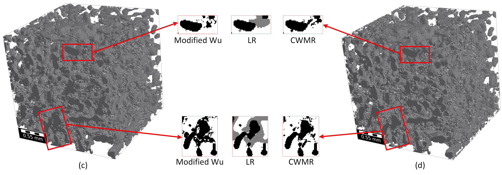

# 📐 Multi-scale Image Reconstruction of Unresolved Microporosity

This repository implements a novel **Cross-Correlation based Watershed Multi-scale Reconstruction (CWMR)** approach to reconstruct unresolved microporosity in 3D heterogeneous rock samples from multi-resolution CT scan images. It also includes an improved implementation of the **Modified Wu et al. method** for comparison.

Developed as part of the research published in:

> _Abolfazl Moslemipour, Saeid Sadeghnejad, et al. (2024). Image-Based Multi-scale Reconstruction of Unresolved Microporosity in 3D Heterogeneous Rock Digital Twins Using Cross-Correlation Simulation and Watershed Algorithm. Transport in Porous Media. DOI: [10.1007/s11242-024-02111-x](https://doi.org/10.1007/s11242-024-02111-x)_

---

## 🧠 Highlights

- Efficient multi-scale image reconstruction of heterogeneous rocks.
- Reduces computational cost and memory by segmenting unresolved porosity using the **watershed algorithm**.
- Preserves **macro–micro pore connectivity** using enhanced **cross-correlation based simulation (CCSIM)**.
- Supports both **CWMR** and **Modified Wu et al. (2019)** methods.
- Validated using petrophysical metrics (porosity, permeability, pore size distribution, Euler number).

---

## 📁 Repository Structure

```bash
.
├── CWMR.py                     # CWMR reconstruction pipeline
├── ModifiedWu.py               # Modified Wu et al. method pipeline
├── computeUnresolved.py        # Watershed segmentation of unresolved porosity
├── extractPoreRegions.py       # Pore segmentation using snow partitioning
├── extractTemplatesCWMR.py     # Template selection for CWMR
├── extracttemplatesWu.py       # Template selection for Modified Wu method
├── bestMatchTemplate.py        # Best-match overlap region search (CCF)
├── CCF.py                      # Cross-correlation function computation
```

---

## 🚀 Installation

1. Clone the repository:
```bash
git clone https://github.com/Abolfazlmsl/Multi-scale-image-reconstruction.git
cd Multi-scale-image-reconstruction
```

2. Install dependencies:
```bash
pip install numpy scikit-image pillow porespy
```

---

## 📷 Input Data

- **LR image stack**: Low-resolution (large FoV) grayscale `.tif` slices.
- **HR image stack**: High-resolution (small FoV) grayscale `.tif` slices.
- Both should be preprocessed (denoised, segmented, and resampled) as described in the paper.

---

## ⚙️ Usage

### 1. Run CWMR Method
```bash
python CWMR.py
```
Make sure to set:
```python
factor = 2
output_path = './output_CWMR/'
lr_image_path = './data/LR_resampled/'
hr_image_path = './data/HR/'
image_format = '*.tif'
```

### 2. Run Modified Wu Method
```bash
python ModifiedWu.py
```
Also configure paths inside the script.

---

## 📊 Output

Each method will generate:
- Reconstructed image slices in `output_path`.
- `.npy` intermediate files: segmentation maps, templates, and placement metadata.
- Optional visual comparison with LR and HR inputs (e.g., porosity, PSD, Euler number).

---

## 🖼️ Examples

Below are visual comparisons of the reconstructed multi-scale images using **CWMR** and **Modified Wu** methods for two different rock types.

### 🪨 Berea Sandstone (BS)
 |

### 🏔️ Edward Brown Carbonate (EBC)


---

## 📝 Citation

If you use this work in your research, please cite:

```bibtex
@article{Moslemipour2024CWMR,
  title={Image-Based Multi-scale Reconstruction of Unresolved Microporosity in 3D Heterogeneous Rock Digital Twins Using Cross-Correlation Simulation and Watershed Algorithm},
  author={Moslemipour, Abolfazl and Sadeghnejad, Saeid and et al.},
  journal={Transport in Porous Media},
  year={2024},
  doi={10.1007/s11242-024-02111-x}
}
```
## 📜 License

This project is licensed under the **MIT License**.  
You are free to use, modify, and distribute this code under the terms of this license.

See the [LICENSE](./LICENSE) file for full details.
